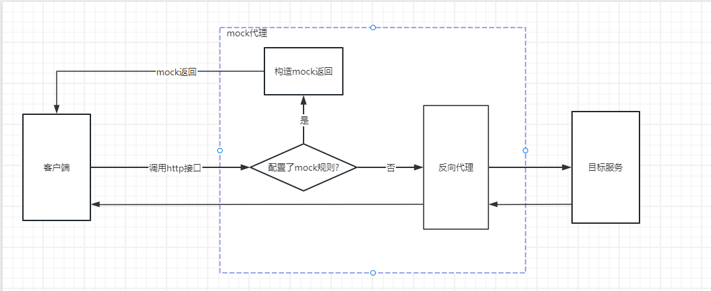

### 介绍
一个http和https服务接口mock代理的工具，可以设置mock的接口和响应码、响应报文。


### 启动mock代理命令
```
java -jar mock-proxy-1.0-SNAPSHOT-jar-with-dependencies.jar -p 8443 -tip dev.kt.looklook.cn -protocol https -jks ./jks-keystore.jks
```
### 命令行参数说明
```
usage: proxy command line usage
 -jks,--jks <arg>                    Specify the jks file path.
 -kpwd,--key-password <arg>          Specify the jks file password,
                                     default: 12345678.
 -p,--port <arg>                     Specify the listen port.
 -P,--password <arg>                 Specify the password.
 -protocol,--target-protocol <arg>   Specify the target http service
                                     protocol, default: http.
 -tip,--target-ip <arg>              Specify the target http service ip or
                                     domain.
 -tport,--target-port <arg>          Specify the target http service port,
                                     if http default as 80, if https
                                     default as 443.
 -U,--username <arg>                 Specify the username.
```

### 代理的接口如下
- 设置mock规则
```
curl --location 'https://127.0.0.1:8443/__proxyApi/setMockRule' \
--header 'Content-Type: application/json' \
--data '{"targetProtocol": "https", "targetIP":"dev.kt.looklook.cn", "targetPort":443, "mockUri": "/getDataNodeList", "mockResponseStatusCode":200, "mockResponseBody": "mock返回的,hello,world"}'
```
- 清空mock规则
```
curl --location 'https://127.0.0.1:8443/__proxyApi/clearMockRule'
```
- 删除mock规则
```
curl --location 'https://127.0.0.1:8443/__proxyApi/deleteMockRule' \
--header 'Content-Type: application/json' \
--data '{"targetProtocol": "https", "targetIP":"dev.kt.looklook.cn", "targetPort":443, "mockUri": "/getDataNodeList", "mockResponseStatusCode":200, "mockResponseBody": "mock返回的"}'
```
- 获取所有mock规则
```
curl --location 'https://127.0.0.1:8443/__proxyApi/getAllMockRule'
```


